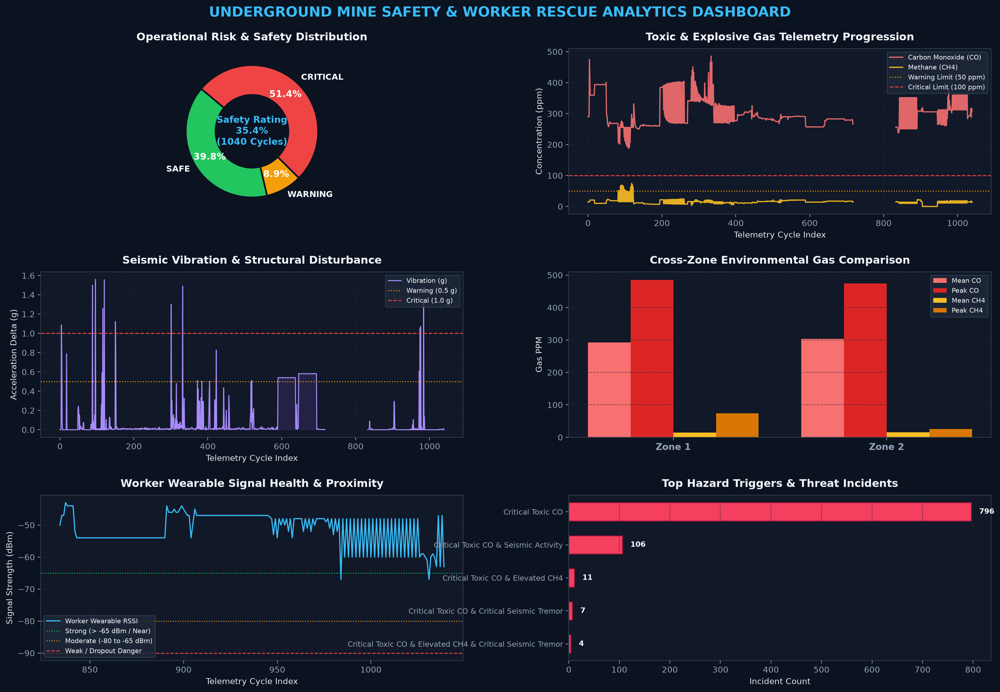

# ⛏️ IoT-Based Underground Mine Safety & Worker Tracking System

[](https://www.python.org/)
[](https://flask.palletsprojects.com/)
[](https://socket.io/)
[](https://scikit-learn.org/)
[](https://www.espressif.com/)

A comprehensive real-time environmental monitoring, predictive hazard analytics, automated rescue reporting, and worker localization platform designed for underground mines (developed for Smart India Hackathon).

The system interfaces with IoT sensor nodes deployed across mine zones and worker wearables, analyzes toxic and explosive gases ($\text{CO}$, $\text{CH}_4$) and seismic vibrations, estimates miner positions via differential RF/RSSI signal strength, predicts impending hazards using dual Random Forest machine learning models, generates multi-sheet Excel audit workbooks and visual analytics dashboards, and triggers bidirectional acoustic and visual alarms.

---

## 📌 Key Highlights

- **Multi-Zone Environmental Telemetry**: Real-time acquisition of hazardous gases (Methane $\text{CH}_4$, Carbon Monoxide $\text{CO}$) and 3-axis seismic vibration data ($ax, ay, az$).
- **Predictive Machine Learning Engine (`sih_model.py`)**:
  - Trained on UCI gas sensor array time-series datasets (`ethylene_CO.txt` and `ethylene_methane.txt`) with synthetic fallback generation when offline.
  - Extracts 14 rolling temporal features (mean, max, min, delta, standard deviation, short-term moving average) over a 20-sample window to forecast hazards $20$ timesteps ahead.
  - Fuses class probabilities (`SAFE`, `WARNING`, `CRITICAL`) across dedicated $\text{CO}$ and $\text{CH}_4$ `RandomForestClassifier` models before gas concentrations breach critical thresholds.
- **Automated Multi-Sheet Excel & Visual Insights Engine**:
  - Generates a 6-sheet formatted Excel workbook (`insights/mine_rescue.xlsx` & `insights/mine_safety_analytics.xlsx`) complete with KPI scorecards, native interactive Excel charts (`PieChart`, `BarChart`), AI diagnostic findings, and Standard Operating Procedure (SOP) rescue directives.
  - Renders a high-resolution, 6-panel dark-mode visual analytics dashboard (`insights/mine_rescue_dashboard.png`) using Matplotlib and embeds it directly into the workbook.
  - Supports both live streaming updates and standalone offline report generation via CLI (`python sih_model.py --insights`).
- **Dynamic Hardware Calibration & Diagnostic Watchdog**:
  - Fast auto-calibration against baseline air quality (`3` samples or `5s` timeout fallback) to prevent startup hangs.
  - Built-in hardware diagnostic watchdog that alerts operators if serial packets are missing or COM ports are locked.
- **Worker Localization & Proximity Tracking**:
  - Continuous position estimation across mine tunnels using dual-zone differential RSSI.
  - Hysteresis ($4.0\text{s}$) and deadband filtering ($6\text{ dBm}$) to suppress RF multipath fading and signal flutter.
  - Directional vector classification (`APPROACHING`, `AWAY`, `STATIONARY`) and proximity exposure auditing.
- **Bidirectional Alerting & Smart Wearable Buzzer**:
  - Automated warning dispatch to worker wearables when miners approach active hazard zones.
  - Heartbeat watchdog detecting miner node disconnection or communication dropout within $10\text{s}$.
  - Instant worker panic button (`WORKER_SOS`) detection with automatic zone assignment.
- **Interactive Control Room Dashboard (`app.py`)**:
  - Low-latency dark-mode operations interface built with Flask, HTML5, CSS3, and Socket.IO.
  - Dynamic 2D SVG tunnel visualization with color-coded safety boundaries and live worker indicator.
- **Hackathon Presentation / Demo Controls**:
  - Dedicated REST API endpoints to simulate danger states, test buzzer responses, and showcase UI reactivity on demand.

---

## 🏗️ Architecture Overview

```text
 ┌──────────────────────┐      ┌──────────────────────┐      ┌──────────────────────┐
 │ Zone 1 Sensor Node   │      │   Worker Wearable    │      │ Zone 2 Sensor Node   │
 │ • MQ-7 (CO Gas)      │      │ • Buzzer / Alarm     │      │ • MQ-7 (CO Gas)      │
 │ • MQ-4 (CH4 Gas)     │      │ • Panic SOS Button   │      │ • MQ-4 (CH4 Gas)     │
 │ • ADXL345 (Vibration)│      │ • Heartbeat & RSSI   │      │ • ADXL345 (Vibration)│
 └──────────┬───────────┘      └──────────┬───────────┘      └──────────┬───────────┘
            │                             │                             │
            └─────────────────────────────┼─────────────────────────────┘
                                          │ Sub-GHz RF / LoRa
                                          ▼
                            ┌───────────────────────────┐
                            │    ESP32 Gateway Node     │
                            └─────────────┬─────────────┘
                                          │ USB UART Serial (115200 Baud)
                                          ▼
                ┌───────────────────────────────────────────────────┐
                │              Python Processing Core               │
                │                                                   │
                │ ┌──────────────────────┐ ┌──────────────────────┐ │
                │ │    app.py (Server)   │ │  sih_model.py (ML)   │ │
                │ │ • Serial UART Bridge │ │ • 14 Temporal Feats  │ │
                │ │ • Baseline Calib.    │ │ • Dual RF Classifiers│ │
                │ │ • RSSI Localization  │ │ • Hazard & SOP Logic │ │
                │ │ • SocketIO Stream    │ │ • OpenPyXL + MPL Gen │ │
                │ └──────────┬───────────┘ └──────────┬───────────┘ │
                └────────────┼────────────────────────┼─────────────┘
                             │ WebSockets             │ Automated Reporting
                             ▼                        ▼
      ┌──────────────────────────────────┐ ┌────────────────────────────────────┐
      │    Control Room Web Dashboard    │ │    Insights & Rescue Analytics     │
      │ • Real-time PPM / Vib Telemetry  │ │ • 6-Tab Excel Audit Workbook       │
      │ • 2D Interactive Mine Tunnel SVG │ │ • Native Interactive Excel Charts  │
      │ • Visual Warning & SOS Banners   │ │ • 6-Panel Visual PNG Dashboard     │
      └──────────────────────────────────┘ └────────────────────────────────────┘
```

---

## 📊 Automated Analytics & Rescue Insights (`insights/`)

The predictive analytics engine (`sih_model.py`) transforms raw multi-zone sensor logs into executive-ready visual and tabular reports stored in the `insights/` directory.

### 1. Multi-Panel Visual Analytics Dashboard (`mine_rescue_dashboard.png`)



Generated at 200 DPI in a dark control-room theme, the visual dashboard tracks six operational dimensions:
1. **Operational Risk & Safety Distribution**: Donut chart of `SAFE`, `WARNING`, and `CRITICAL` cycles with an overall Mine Safety Rating badge.
2. **Toxic & Explosive Gas Telemetry Progression**: Time-series progression of $\text{CO}$ and $\text{CH}_4$ concentrations against warning ($50\text{ ppm}$) and critical ($100\text{ ppm}$) thresholds.
3. **Seismic Vibration & Structural Disturbance**: Acceleration delta ($g$) spike profile monitoring tunnel stability.
4. **Cross-Zone Environmental Gas Comparison**: Clustered bar chart comparing mean and peak $\text{CO}$ and $\text{CH}_4$ levels across Zone 1 and Zone 2.
5. **Worker Wearable Signal Health & Proximity**: LoRa RSSI tracking categorized into Strong ($\ge -65\text{ dBm}$), Moderate ($-80\text{ to }-65\text{ dBm}$), and Weak/Dropout zones.
6. **Top Hazard Triggers & Threat Incidents**: Frequency breakdown of specific hazard categories.

### 2. Multi-Sheet Excel Audit Workbook (`mine_rescue.xlsx` / `mine_safety_analytics.xlsx`)

Every analytics sync produces a styled, 6-sheet Excel workbook via `openpyxl`:

| Sheet Name | Contents & Visual Elements |
| :--- | :--- |
| **1. Analytics Dashboard** | Color-coded KPI summary cards, embedded 6-panel visual analytics PNG, and a Cross-Zone Real-Time Telemetry & Health Scorecard. |
| **2. Executive Summary** | High-level operational metrics, automated AI diagnostic findings, actionable Rescue SOP directives, and an embedded native **Operational Risk Pie Chart**. |
| **3. Zone Risk Analysis** | Per-zone statistical breakdown (Safe/Warning/Critical %, $\text{CO}$ & $\text{CH}_4$ mean/max/std dev, vibration peaks, mean RSSI) with a native **Clustered Column Chart**. |
| **4. Hazard Incidents Log** | Filtered incident log of all `WARNING` and `CRITICAL` events paired with automated `Hazard Category` labels and `Safety Directive` instructions. |
| **5. Worker Proximity & Exposure** | RSSI distance band distribution (Close, Mid, Far), high-hazard exposure cycle counts, proximity risk index, and a native **Proximity Breakdown Bar Chart**. |
| **6. Sensor Data** | Complete timestamped audit trail including raw voltages, converted PPM values, vibration ($g$), RSSI, fused ML class probabilities, and safety directives. |

---

## 📡 Serial Protocol Specification

Communication between the ESP32 Gateway and the Python runtime uses structured text frames over UART serial (`115200` baud):

### 1. Inbound Telemetry (Hardware ➔ Python)

- **Environmental Sensor Packet**:
  ```text
  PYTHON_DATA:ZONE=1,MQ7=450.5,MQ4=310.2,AX=0.02,AY=-0.01,AZ=0.98,WRSSI=-68.0
  ```
  | Field | Meaning |
  | :--- | :--- |
  | `ZONE` | Target mine zone ID (`1` or `2`) |
  | `MQ7` | Analog reading / millivolts from Carbon Monoxide sensor |
  | `MQ4` | Analog reading / millivolts from Methane sensor |
  | `AX, AY, AZ` | 3-axis accelerometer readings (in $g$) |
  | `WRSSI` | Received signal strength of the worker node (in $\text{dBm}$) |
  | `DIR` *(optional)* | Worker movement direction tag (`APPROACHING`, `AWAY`, `STATIONARY`) |

- **Worker Panic Alert (SOS)**:
  ```text
  WORKER_SOS:STATE=1
  ```
- **Worker Heartbeat (Liveness)**:
  ```text
  WORKER_HEARTBEAT:
  ```

### 2. Outbound Commands (Python ➔ Gateway)

- **Control Room Web Server (`app.py`) Actuator Frame**:
  ```text
  PYTHON_COMMAND:ZONE=1,RISK=WARNING,ALERT=WARNING,WRSSI=-68,BUZZER=ON
  ```
- **ML Predictive Engine (`sih_model.py`) Alert Frame**:
  ```text
  ALERT,ZONE=1,RISK=CRITICAL,DIRECTION=CRITICAL,BUZZER=HIGH
  ```
  *Commands are throttled and deduplicated to protect RF bandwidth.*

---

## 📂 Project Structure

```text
underground-mine-safety-rescue-system/
├── app.py                             # Flask + SocketIO control server, serial bridge, & web UI
├── sih_model.py                       # Dual Random Forest ML engine, serial bridge, & Excel/PNG insights generator
├── templates/                         # Web interface templates
│   └── index.html                     # Real-time control room dashboard with 2D SVG tunnel view
├── insights/                          # Generated analytical workbooks and visual dashboards
│   ├── mine_rescue_dashboard.png      # 6-panel dark-mode visual analytics dashboard (PNG)
│   └── mine_safety_analytics.xlsx     # Multi-sheet Excel safety & rescue analytics report
├── data/                              # Time-series gas sensor training datasets (ignored in git)
│   ├── ethylene_CO.txt                # Carbon Monoxide (CO) sensor array dataset
│   └── ethylene_methane.txt           # Methane (CH4) sensor array dataset
├── requirements.txt                   # Python package dependencies (Flask, scikit-learn, openpyxl, etc.)
├── .gitignore                         # Excludes heavy datasets (data/), cache, & virtualenvs
├── .gitattributes                     # Line-ending normalization rules
├── LICENSE                            # MIT License
└── README.md                          # System documentation
```

---

## ⚡ Getting Started

### Prerequisites

- **Python 3.8 or higher**.
- An ESP32 or compatible gateway connected via USB serial (optional for demo mode and offline analytics).

### Installation

1. **Clone the repository:**
   ```bash
   git clone https://github.com/ddvkernel/underground-mine-safety-rescue-system.git
   cd underground-mine-safety-rescue-system
   ```

2. **Create and activate a virtual environment:**
   ```bash
   # Windows (PowerShell)
   python -m venv venv
   .\venv\Scripts\Activate.ps1

   # macOS / Linux
   python3 -m venv venv
   source venv/bin/activate
   ```

3. **Install dependencies:**
   ```bash
   pip install -r requirements.txt
   ```

---

## ⚙️ Configuration

Both [`app.py`](app.py) and [`sih_model.py`](sih_model.py) expose hardware and threshold settings near the top of each script (and also support `SERIAL_PORT`, `BAUD_RATE`, `HOST`, and `PORT` environment variables):

```python
# Hardware Serial Port & Baud Rate
SERIAL_PORT = "COM5"           # Set to match your ESP32's COM port (e.g. 'COM3' or '/dev/ttyUSB0')
BAUD_RATE = 115200

# app.py Calibration & Real-time Risk Thresholds
CALIBRATION_SAMPLES = 3        # Number of samples for air baseline
CALIBRATION_TIMEOUT_S = 5      # Maximum calibration time before auto-completing
GAS_WARNING_DEVIATION = 0.25   # +25% baseline increase triggers WARNING
GAS_CRITICAL_DEVIATION = 0.60  # +60% baseline increase triggers CRITICAL
VIB_WARNING = 0.5              # 0.5g acceleration delta triggers WARNING
VIB_CRITICAL = 1.0             # 1.0g acceleration delta triggers CRITICAL
WORKER_OFFLINE_TIMEOUT = 10.0  # Heartbeat timeout in seconds

# sih_model.py Predictive ML & PPM Thresholds
WINDOW_SIZE = 20               # Rolling time-series window length
FUTURE_HORIZON = 20            # Future steps ahead to forecast risk
CO_WARNING, CO_CRITICAL = 50.0, 100.0    # CO thresholds (ppm)
CH4_WARNING, CH4_CRITICAL = 50.0, 100.0  # CH4 thresholds (ppm)
```

> [!TIP]
> When `app.py` launches, it scans all connected serial ports on your machine and displays them in the console with indicators showing whether the configured `SERIAL_PORT` is detected.

---

## 🖥️ Running the System

### Option A: Run the Live Control Room Dashboard (`app.py`)

Starts the Flask-SocketIO server, serial communications threads, watchdogs, and real-time web UI:
```bash
python app.py
```
Open your browser at:
```text
http://127.0.0.1:5000
```

### Option B: Run the Predictive ML & Insights Engine (`sih_model.py`)

1. **Live Serial + ML Prediction Mode:**
   Trains the dual Random Forest models, connects to the ESP32 gateway, evaluates live readings every 5 seconds, dispatches worker buzzer alerts, and updates the Excel workbook and PNG dashboard:
   ```bash
   python sih_model.py --port COM5
   ```
   *(If the serial gateway is unplugged, `sih_model.py` automatically falls back to generating the full Excel and PNG insights reports from existing telemetry logs.)*

2. **Offline Analytics & Report Generation Mode (`--insights`):**
   Regenerate the 6-sheet Excel workbook and 6-panel visual dashboard PNG directly from historical telemetry without opening a serial connection:
   ```bash
   python sih_model.py --insights
   ```

3. **Custom Output Path:**
   ```bash
   python sih_model.py --insights --excel insights/mine_safety_analytics.xlsx
   ```

---

## 🎯 Demo & Presentation Mode

During presentations or when physical sensor nodes are unavailable, simulate live hazard scenarios and test dashboard reactivity using these endpoints:

| Action | URL / Method | Description |
| :--- | :--- | :--- |
| **Simulate Critical State** | `GET http://127.0.0.1:5000/api/demo/2/CRITICAL` | Forces Zone 2 to `CRITICAL` and triggers alarms |
| **Simulate Warning State** | `GET http://127.0.0.1:5000/api/demo/2/WARNING` | Forces Zone 2 to `WARNING` |
| **Simulate Safe State** | `GET http://127.0.0.1:5000/api/demo/2/SAFE` | Resets Zone 2 to `SAFE` |
| **Clear Manual Override** | `GET http://127.0.0.1:5000/api/demo/2/CLEAR` | Resumes listening to physical sensor data |
| **Clear SOS Panic State** | `POST http://127.0.0.1:5000/api/clear_sos` | Dismisses active worker emergency alert |
| **Export Current State** | `GET http://127.0.0.1:5000/api/data` | Returns current multi-zone state dictionary as JSON |

*(Replace `2` with `1` in the URL to control Zone 1.)*

---

## 🛡️ Sensor & Component Overview

| Component | Role | Interface |
| :--- | :--- | :--- |
| **ESP32 MCU** | Edge controller, LoRa/RF receiver, UART gateway bridge | Wi-Fi / LoRa / UART |
| **MQ-7 Sensor** | Carbon Monoxide ($\text{CO}$) toxic gas detection | Analog ADC |
| **MQ-4 Sensor** | Methane ($\text{CH}_4$) combustible gas detection | Analog ADC |
| **ADXL345 / MPU** | 3-axis accelerometer for structural & seismic vibration shifts | I2C / SPI |
| **Wearable Node** | Worker badge with panic button, heartbeat transmitter, & buzzer | RF Sub-GHz / LoRa |

---

## 📄 License

Developed for the Smart India Hackathon (SIH). Distributed under the [MIT License](LICENSE).
